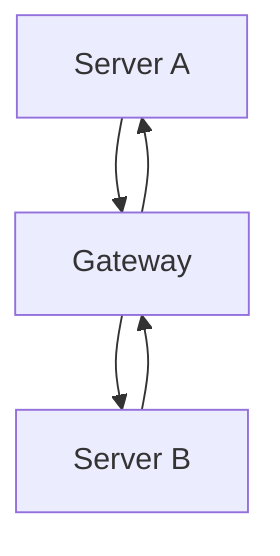

# What is a server gateway?
The server gateway allows messages to be transferred between Server A and Server B in both directions.



# requirements
```
1. python 3.8+
2. A Discord bot token
3. Potato Pc
```

# install

### Step 1.  
> create a bot at [discord.dev](https://discord.com/developers/applications)  
> Go to the "Bot" tab and **enable intents**:
> - ✅ MESSAGE CONTENT INTENT  
> - ✅ SERVER MEMBERS INTENT
---

### Step 2. 
> Install libs  
> 
> ```bash
> pip install -r requirements.txt
> ```
---

### Step 3.
> Config bot
> 
> Open the file config.yml
> 
> Paste your bot token into Bot_Token
> 
> Adjust other settings like Statics, Firewall, etc.
> 
### Step 4.
> run bot
> 
> ```bash
> python main.py
> ```


## License

This project is licensed under the **GNU Affero General Public License v3.0 (AGPL-3.0)**.

You are free to:

- ✅ Use this project for personal or commercial purposes
- ✅ Modify and adapt it to your needs
- ✅ Distribute it, with or without modifications

**However**, you must:

- 🔓 Keep the source code **public** if you distribute or deploy a modified version (even as a web service)
- 📄 Include this license and credit the original author
- 🔁 Share any modifications under the same license

**In short:** If you use this project or create a fork, your version must remain **open source**.

[Learn more about AGPL-3.0](https://www.gnu.org/licenses/agpl-3.0.en.html)
